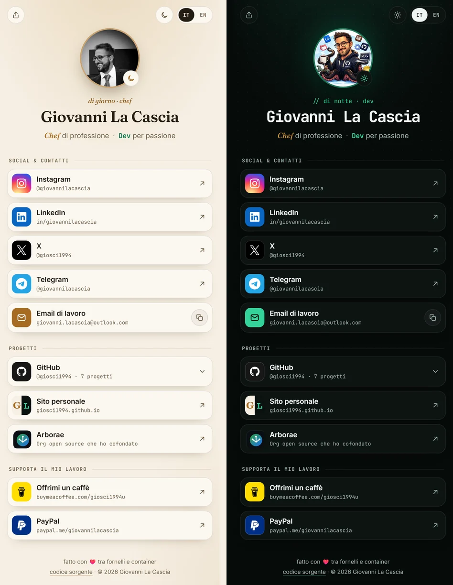

# 🔗 linktome

**All my links in one place — Giovanni La Cascia, chef by trade, dev by passion.**
A tiny link-in-bio page in the same style as [my personal site](https://giosci1994.github.io):
by day the Chef, by night the Dev.

**🇬🇧 English** · [🇮🇹 Italiano](#italiano)

<p align="center">
  <a href="https://giosci1994.github.io/linktome/"></a>
  
  
  
  <a href="LICENSE"></a>
  <a href="https://buymeacoffee.com/giosci1994u"></a>
</p>

<p align="center">
  <a href="https://giosci1994.github.io/linktome/">
    
  </a>
</p>

<p align="center"><strong>🌐 Live: <a href="https://giosci1994.github.io/linktome/">giosci1994.github.io/linktome</a></strong></p>

---

## ✨ Highlights

- 🌗 **Day = Chef, night = Dev** — warm paper, amber and serif by day; dark green and mono by
  night. It follows the system theme, and tapping the photo flips it to the other side.
- 🐙 **Interactive GitHub card** — tap it and it opens on my featured repositories, with
  language, stars and last update fetched live from the GitHub API.
- 🌍 **Bilingual IT/EN** — picks the browser language and shares the choice with the main site.
- 📧 **Email kept away from bots** — the address is assembled in JavaScript, with a one-tap
  copy button.
- 📤 **Share button** — native share sheet on phones, copy-to-clipboard elsewhere.
- ⚡ **Zero build step** — plain HTML + CSS + vanilla JS. The links work even without JavaScript.
- ♿ **Accessible** — real buttons and lists, ARIA states, keyboard focus,
  `prefers-reduced-motion` aware.

## 🔗 The links

| | |
|---|---|
| 📸 Instagram | [@giovannilacascia](https://www.instagram.com/giovannilacascia/) |
| 💼 LinkedIn | [in/giovannilacascia](https://www.linkedin.com/in/giovannilacascia/) |
| 𝕏 X | [@giosci1994](https://x.com/giosci1994) |
| ✈️ Telegram | [@giovannilacascia](https://t.me/giovannilacascia) |
| 🏠 Home Assistant Community | [@giosci1994](https://community.home-assistant.io/u/giosci1994/summary) |
| 🐙 GitHub | [@giosci1994](https://github.com/giosci1994) |
| 🌐 Website | [giosci1994.github.io](https://giosci1994.github.io) |
| 🌱 Arborae | [arborae.github.io](https://arborae.github.io) |
| ☕ Buy Me a Coffee | [giosci1994u](https://buymeacoffee.com/giosci1994u) |
| 💳 PayPal | [paypal.me/giovannilacascia](https://paypal.me/giovannilacascia) |

## 🧩 Project structure

```
index.html        the page: every link is plain HTML
style.css         day (Chef) and night (Dev) themes
app.js            IT/EN, theme switch, email, share, live GitHub data
assets/
  avatar-chef.webp / avatar-dev.webp   the two faces of the avatar
  favicon.svg, arborae.svg             icons
  og-image.jpg                         1200×630 social preview
  preview.webp                         screenshot for this README
```

## ✏️ Adding or changing a link

1. Copy one `<li>` inside a `.links` list in `index.html` and change `href`, title and subtitle.
2. Pick a tile colour: add a `.tile-yourbrand` rule in `style.css` and, if needed, an icon
   `<symbol>` at the top of `index.html` (brand icons come from [Simple Icons](https://simpleicons.org), CC0).
3. Translatable text gets a `data-i18n="key"` attribute, with the key in both `it` and `en` in `app.js`.

**Featured repositories** are `<li class="repo" data-repo="name">` items inside the GitHub card:
the name must match the repository on GitHub, and stars, language and last update are filled in
automatically.

## 🛠️ Run locally

```bash
git clone https://github.com/giosci1994/linktome.git
cd linktome
python -m http.server 8000        # → http://localhost:8000
```

## 🚀 Deploy

GitHub Pages, **Deploy from a branch** → `main` / `(root)`. Every push to `main` is online at
**https://giosci1994.github.io/linktome/** within a minute or two.

## ☕ Support

If one of my projects is useful to you, you can buy me a coffee.

<a href="https://buymeacoffee.com/giosci1994u"></a>

## 📄 License

The **source code** (HTML/CSS/JS) is released under the [GNU GPLv3 License](LICENSE).

> ℹ️ **Not covered by GPLv3:** the personal photographs and avatar (`avatar-*.webp`,
> `og-image.jpg`, `preview.webp`), the personal branding and the Arborae logo are
> © their owners, all rights reserved. Brand icons are trademarks of their respective owners.

<br>

---
---

<a id="italiano"></a>

# 🇮🇹 Italiano

**Tutti i miei link in un posto — Giovanni La Cascia, chef di professione, dev per passione.**
Una piccola pagina "link in bio" con lo stesso stile del [mio sito](https://giosci1994.github.io):
di giorno lo Chef, di notte il Dev.

<p align="center"><strong>🌐 Online: <a href="https://giosci1994.github.io/linktome/">giosci1994.github.io/linktome</a></strong></p>

## ✨ In breve

- 🌗 **Giorno = Chef, notte = Dev** — carta, ambra e serif di giorno; verde scuro e mono di
  notte. Segue il tema del sistema e, toccando la foto, si gira dall'altra parte.
- 🐙 **Card GitHub interattiva** — toccandola si apre sui repository in evidenza, con
  linguaggio, stelle e ultimo aggiornamento presi dal vivo dall'API di GitHub.
- 🌍 **Bilingue IT/EN** — sceglie la lingua del browser e condivide la scelta con il sito principale.
- 📧 **Email al riparo dai bot** — l'indirizzo è composto in JavaScript, con un tasto per copiarlo.
- 📤 **Tasto condividi** — il menu di condivisione nativo sul telefono, copia del link altrove.
- ⚡ **Zero build step** — solo HTML + CSS + JS vanilla. I link funzionano anche senza JavaScript.
- ♿ **Accessibile** — pulsanti e liste veri, stati ARIA, focus da tastiera,
  rispetta `prefers-reduced-motion`.

## ✏️ Aggiungere o cambiare un link

1. Copia un `<li>` dentro una lista `.links` di `index.html` e cambia `href`, titolo e sottotitolo.
2. Scegli il colore del riquadro: una regola `.tile-tuobrand` in `style.css` e, se serve, un
   `<symbol>` per l'icona in cima a `index.html` (icone dei brand da [Simple Icons](https://simpleicons.org), CC0).
3. I testi da tradurre hanno l'attributo `data-i18n="chiave"`, con la chiave in `it` e in `en` dentro `app.js`.

I **repository in evidenza** sono gli `<li class="repo" data-repo="nome">` dentro la card GitHub:
il nome deve essere quello del repository, stelle, linguaggio e ultimo aggiornamento arrivano da soli.

## 🛠️ Avvio in locale

```bash
git clone https://github.com/giosci1994/linktome.git
cd linktome
python -m http.server 8000        # → http://localhost:8000
```

## 🚀 Deploy

GitHub Pages, **Deploy from a branch** → `main` / `(root)`. Ogni push su `main` va online su
**https://giosci1994.github.io/linktome/** in un paio di minuti.

## ☕ Supporta il progetto

Se uno dei miei progetti ti è utile, puoi offrirmi un caffè.

<a href="https://buymeacoffee.com/giosci1994u"></a>

## 📄 Licenza

Il **codice sorgente** (HTML/CSS/JS) è rilasciato con [licenza GNU GPLv3](LICENSE).

> ℹ️ **Non coperti da GPLv3:** le foto personali e l'avatar (`avatar-*.webp`, `og-image.jpg`,
> `preview.webp`), il personal branding e il logo di Arborae sono © dei rispettivi proprietari,
> tutti i diritti riservati. Le icone dei brand sono marchi dei rispettivi proprietari.

---

<p align="center"><sub>fatto con ❤️ tra fornelli e container · made with ❤️ between stoves and containers</sub></p>
